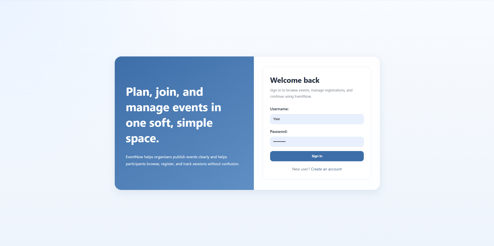
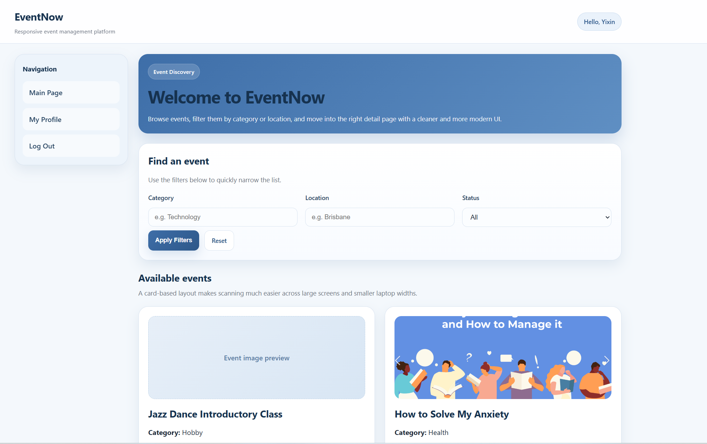
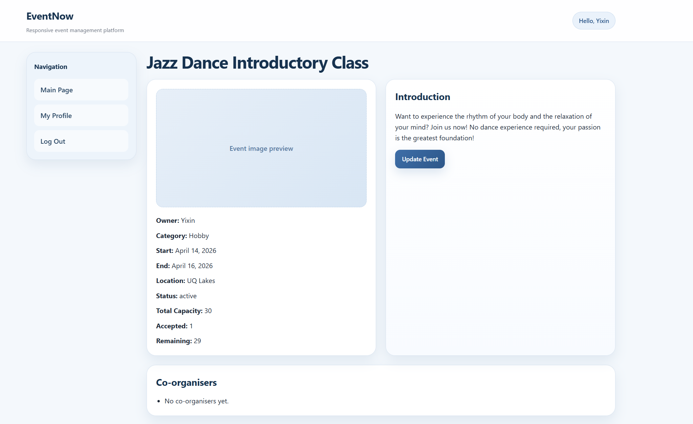
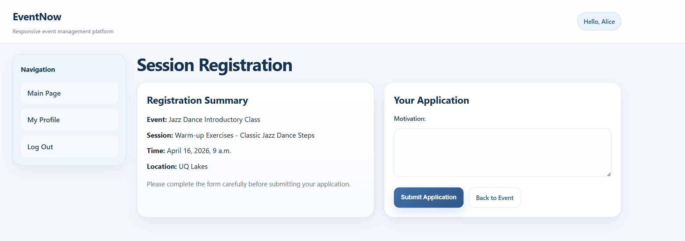
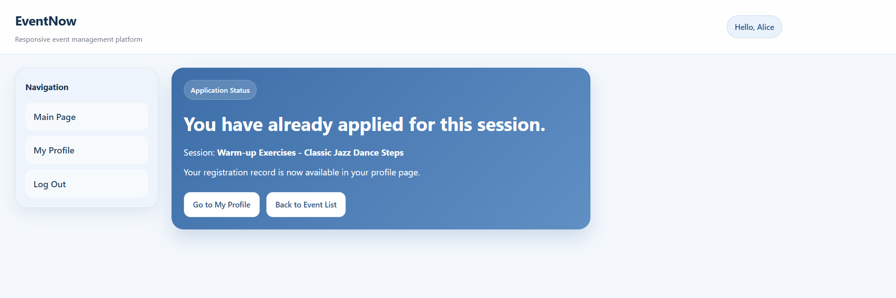
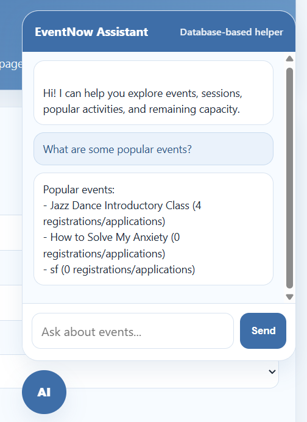

# EventNow 活动管理系统

> 一个覆盖活动发布、场次管理、报名审批与角色权限控制的 Django 全栈项目。

EventNow 是一个基于 Django 的活动管理 Web 应用，面向三类角色：管理员、活动组织者和普通参与者。系统支持活动发布、场次管理、报名申请、容量追踪、订阅计划限制、个人资料维护，以及一个基于规则和数据库信息的 EventNow Assistant。

项目最初部署在 UQCloud Zone，用于展示一个 SaaS 风格的活动管理平台原型。

## 历史部署

部署地址：

[https://infs3202-3f129ed3.uqcloud.net/eventnow/login/](https://infs3202-3f129ed3.uqcloud.net/eventnow/login/)

说明：公开 README 不建议放置真实用户名和密码。课程评分或演示所需账号建议通过提交平台、课程文档或安全渠道提供。

## 核心功能

- 用户注册与登录：支持参与者和组织者注册，管理员进入 Django Admin。
- 角色权限控制：根据管理员、组织者、参与者身份进入不同页面与工作流。
- 活动管理：组织者可以创建、查看、更新和归档自己的活动。
- 场次管理：组织者可以创建、更新、取消活动场次，并管理场次容量。
- 报名申请：参与者可以浏览活动、查看详情、选择场次并提交申请。
- 审批流程：组织者可以批准或拒绝报名申请，系统会同步更新剩余容量。
- 个人资料：用户可以更新用户名、邮箱和密码。
- 订阅计划：组织者需要选择订阅计划，系统根据计划限制活动数量和场次数量。
- EventNow Assistant：通过规则意图识别、数据库记录和知识文章回答常见问题。

## 项目界面

> 以下截图来自项目在学校 UQCloud 虚拟平台上的真实运行环境。由于该教学环境不提供长期公开访问，这里通过界面截图展示主要功能和角色工作流。

### 登录与身份认证

用户可以登录已有账号，也可以进入注册页面创建参与者或组织者账号。登录后，系统会根据用户角色进入对应的功能流程。



### 活动发现与筛选

参与者可以按照活动分类、地点和状态筛选活动，并通过卡片快速查看活动摘要和封面。



### 组织者活动管理

组织者可以查看活动信息、容量和报名情况，并继续更新活动、管理场次和处理参与者申请。



### 场次报名流程

参与者在确认活动、场次、时间和地点后，可以填写报名动机并提交申请。



提交成功后，系统会阻止同一用户重复报名同一场次，并引导用户返回个人中心查看申请状态。



### EventNow Assistant

页面内置基于数据库信息和规则意图识别的助手，可回答热门活动、场次、剩余容量和平台操作等问题。

<p align="center">
  
</p>

## 技术栈

- Python
- Django
- SQLite
- Django Admin
- HTML
- CSS
- JavaScript
- UQCloud Zone
- Gunicorn

## 项目结构

```text
s5004312_finalwebproject/
├── .github/workflows/django.yml
├── .env.example
├── .gitignore
├── docs/screenshots/         # README 使用的真实运行截图
├── manage.py
├── requirements.txt
├── README.md
├── eventnow/
│   ├── settings.py
│   ├── urls.py
│   ├── asgi.py
│   ├── wsgi.py
│   └── main/
│       ├── admin.py
│       ├── apps.py
│       ├── forms.py
│       ├── models.py
│       ├── urls.py
│       ├── views.py
│       ├── migrations/
│       └── templates/main/
└── media/                    # 本地运行后生成，不提交到仓库
```

## 数据模型概览

项目围绕以下核心对象组织：

- `UserProfile`：扩展用户角色与订阅状态。
- `SubscriptionPlan`：定义组织者可创建的活动与场次上限。
- `Event`：保存活动标题、分类、地点、日期、状态、图片和创建者。
- `Session`：保存活动下的具体场次、时间、地点、容量和状态。
- `Application`：记录参与者对场次的报名申请与审批状态。
- `EventMember`：为未来的协作组织者或只读组织者访问保留扩展空间。
- `KnowledgeArticle`：为 EventNow Assistant 提供可控知识内容。

## 本地安装与运行

### 1. 获取项目

```bash
git clone https://github.com/Hedyyaokuo/event-management-system.git
cd event-management-system
```

### 2. 创建虚拟环境

Windows PowerShell：

```powershell
py -m venv .venv
.\.venv\Scripts\Activate.ps1
```

macOS 或 Linux：

```bash
python3 -m venv .venv
source .venv/bin/activate
```

### 3. 安装依赖

```bash
pip install -r requirements.txt
```

### 4. 配置环境变量

本地开发可以直接使用项目提供的安全开发默认值。需要自定义配置时，请参考 `.env.example`，并在终端或部署平台中设置相应环境变量。例如：

```powershell
$env:DJANGO_SECRET_KEY="your-local-secret"
$env:DJANGO_DEBUG="True"
$env:DJANGO_ALLOWED_HOSTS="127.0.0.1,localhost"
```

`.env` 已加入忽略规则，不应提交真实密钥。项目不会自动读取 `.env` 文件，环境变量应由终端、IDE 或云平台注入。

### 5. 初始化数据库

```bash
python manage.py migrate
```

如需使用后台管理功能，可以创建本地管理员：

```bash
python manage.py createsuperuser
```

### 6. 启动项目

```bash
python manage.py runserver
```

打开本地页面：

[http://127.0.0.1:8000/eventnow/](http://127.0.0.1:8000/eventnow/)

## 运行检查

```bash
python manage.py makemigrations --check --dry-run
python manage.py check
python manage.py test
```

仓库中的 GitHub Actions 会在推送到 `main` 或提交 Pull Request 时自动执行以上检查。

## 设计说明

系统大量使用状态字段，而不是直接物理删除核心记录。例如活动可以被标记为 `active`、`closed`、`removed` 或 `completed`，场次可以被标记为 `open` 或 `cancelled`，申请可以被标记为 `pending`、`accepted`、`rejected`、`cancelled` 或 `invalid`。这种设计可以保留报名历史，并减少活动、场次和申请之间的连锁删除风险。

前端 JavaScript 主要写在 Django 模板中，用于处理容量刷新、报名取消、审批按钮、资料更新和 Assistant 交互。对于当前课程项目规模，这样可以让页面逻辑和模板上下文保持直接对应；如果进一步产品化，可以把重复脚本迁移到独立静态文件中。

## 测试与验证

建议重点验证以下流程：

- 新用户注册后能根据角色进入正确页面。
- 组织者选择订阅计划后，活动创建数量受到限制。
- 活动和场次状态变化后，参与者页面能正确隐藏无效内容。
- 参与者不能重复报名同一个场次。
- 场次容量满额后，组织者不能继续批准超额申请。
- 修改密码后当前会话保持有效。
- Assistant 只基于系统数据和知识文章回答支持范围内的问题。

## 安全注意事项

- 不要把真实账号密码、生产密钥或部署密钥提交到公开仓库。
- `db.sqlite3` 可能包含用户资料和密码哈希，因此已从公开仓库排除。
- 用户上传的 `media/` 文件默认不纳入版本控制。
- 如果部署到公开环境，应关闭 `DEBUG`，配置 `ALLOWED_HOSTS`，并使用生产数据库与静态文件服务。
- 旧的 UQCloud 地址仅作为历史项目演示地址，不代表当前仓库自动部署状态。

## AI 使用说明

开发过程中使用了生成式 AI 工具辅助学习 Django 概念、理解报错、整理文档和思考权限控制、状态删除、容量追踪、订阅限制与 Assistant 行为。所有 AI 辅助内容均经过作者检查、修改、测试和整合，最终实现与解释责任由作者承担。
